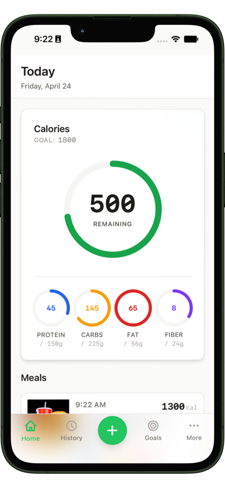
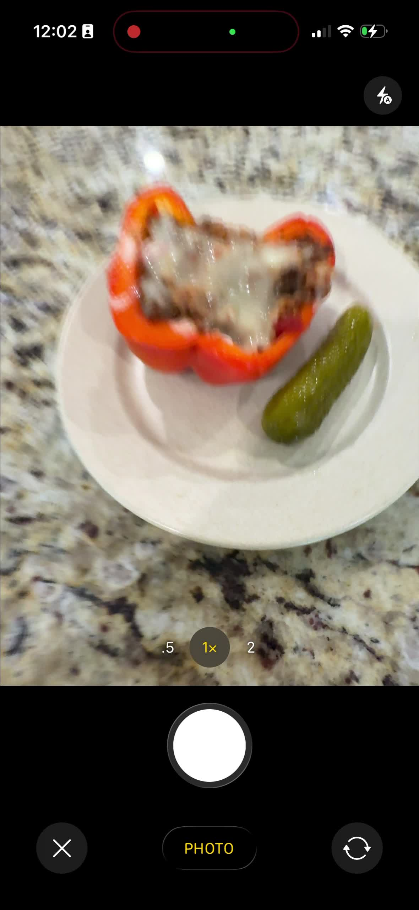
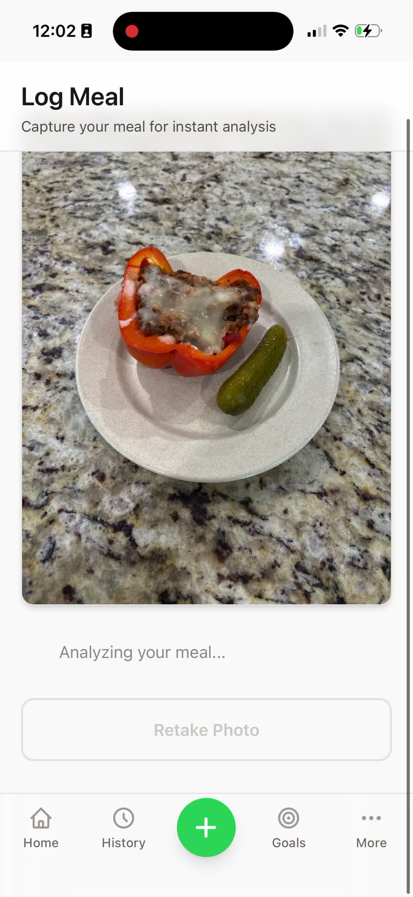
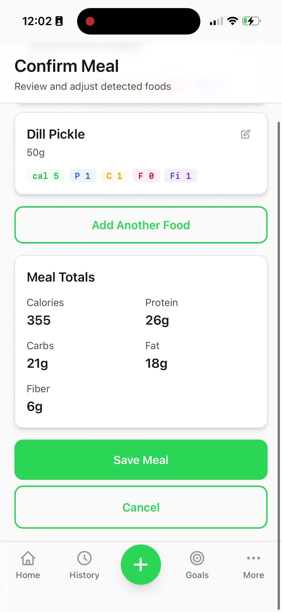

# MacroTracker

AI-powered nutrition tracking from a single meal photo.

[Live app](https://james-dyer.github.io/macro-tracker/) · [Product requirements](PRD.md) · [QA checklist](QA_CHECKLIST.md)

<p align="center">
  
</p>

MacroTracker is an installable React PWA that turns a meal photo into an editable
nutrition log. It identifies foods, estimates portions, calculates calories and
macros, and lets the user review the results before saving.

The project is currently in closed beta. New accounts need a valid invite code
before they can complete onboarding and use the app.

> AI-generated nutrition values are estimates. MacroTracker makes every result
> editable so users can correct food names, portions, and macros before or after
> saving.

## Features

- Analyze a meal from one photo, with optional cooking or ingredient context
- Track calories, protein, carbohydrates, fat, and fiber
- Review and edit AI results before saving
- Set personalized goals with a BMR/TDEE calculator or manual targets
- View daily progress and meal history
- Install as a PWA with offline-aware caching
- Use light or dark mode
- Protect user data with Supabase Auth, Storage, and row-level security
- Gate beta access with redeemable invite codes

<p align="center">
  
  
  
</p>

## How It Works

1. Take or upload a photo of a meal.
2. MacroTracker uploads compressed full-size and thumbnail images to private
   Supabase Storage.
3. The `analyze-meal` Edge Function validates the user and asks Gemini 2.5 Flash
   Lite to identify the foods and estimate nutrition. GPT-4o Mini is the fallback
   provider.
4. Review and correct the generated food items.
5. Save the meal and see the daily macro totals update.

## Tech Stack

| Layer | Technology |
| --- | --- |
| Frontend | React 19, TypeScript, Vite 7, Tailwind CSS 4 |
| PWA | `vite-plugin-pwa`, Workbox |
| Backend | Supabase PostgreSQL, Auth, Storage, Edge Functions |
| AI | Google Gemini 2.5 Flash Lite, OpenAI GPT-4o Mini fallback |
| Deployment | GitHub Pages |

## Architecture

```text
Browser / installed PWA
├── React pages, contexts, hooks, and UI components
├── Client-side image compression and thumbnail generation
└── Supabase client
    ├── Auth and invite redemption
    ├── PostgreSQL with row-level security
    ├── Private meal-photo storage
    └── Edge Functions
        ├── analyze-meal → Gemini, then OpenAI fallback
        └── save-meal → validated meal and food-item inserts
```

Daily totals are calculated from saved food items rather than stored separately.
Photos use signed URLs and are isolated by user-owned storage paths.

## Repository Layout

```text
.
├── pwa/                 # React PWA
│   ├── src/pages/       # Route-level screens
│   ├── src/components/  # UI, layout, and auth components
│   ├── src/hooks/       # Data access and reusable state
│   └── src/contexts/    # Auth and theme providers
├── supabase/
│   ├── functions/       # Deno Edge Functions
│   ├── migrations/      # Database schema and RLS migrations
│   └── scripts/         # Invite and entitlement utilities
├── PRD.md               # Product requirements and domain context
├── QA_CHECKLIST.md      # Pre-production manual test plan
└── CLAUDE.md            # Detailed architecture and contributor guidance
```

## Local Development

### Prerequisites

- Node.js 20
- npm
- Access to a configured Supabase project

Supabase schema changes and Edge Function deployment follow the repository
workflow documented in [`CLAUDE.md`](CLAUDE.md). Do not commit any environment
files or secret keys.

### Frontend Setup

```bash
git clone https://github.com/James-Dyer/macro-tracker.git
cd macro-tracker/pwa
npm ci
cp .env.local.example .env.local
```

Set the public frontend credentials in `pwa/.env.local`:

```dotenv
VITE_SUPABASE_URL=https://your-project.supabase.co
VITE_SUPABASE_ANON_KEY=your-anon-key
```

Then start the development server:

```bash
npm run dev
```

Vite serves from `http://localhost:5173`; the app route is
`http://localhost:5173/macro-tracker/`. The router basename matches the GitHub
Pages deployment path.

### Edge Function Configuration

The Edge Functions require Supabase-provided credentials and at least one AI
provider key:

| Variable | Used by |
| --- | --- |
| `SUPABASE_URL` | `analyze-meal`, `save-meal` |
| `SUPABASE_ANON_KEY` | `analyze-meal`, `save-meal` |
| `SUPABASE_SERVICE_ROLE_KEY` | `analyze-meal` storage access |
| `GEMINI_API_KEY` | Primary meal analysis provider |
| `OPENAI_API_KEY` | Optional fallback meal analysis provider |

Edge Functions are deployed with platform JWT verification disabled because
they manually validate the caller's JWT. See [`CLAUDE.md`](CLAUDE.md) before
changing or deploying them.

## Commands

Run frontend commands from `pwa/`:

| Command | Purpose |
| --- | --- |
| `npm run dev` | Start the Vite development server |
| `npm run build` | Type-check and create a production build |
| `npm run lint` | Run ESLint |
| `npm run preview` | Preview the production build locally |

Before opening a pull request:

```bash
cd pwa
npm run lint
npm run build
```

Use [`QA_CHECKLIST.md`](QA_CHECKLIST.md) for end-to-end verification, including
mobile camera capture, invite redemption, onboarding, meal analysis, and PWA
installation.

## Deployment

The frontend deploys to GitHub Pages when changes reach `main`. The workflow
builds `pwa/` using the repository variables `VITE_SUPABASE_URL` and
`VITE_SUPABASE_ANON_KEY`, then publishes `pwa/dist`.

Backend migrations, secrets, and Edge Functions are managed separately through
Supabase. Invite-code administration is documented in
[`INVITE_CODES_QUICKSTART.md`](INVITE_CODES_QUICKSTART.md).

## Project Status

MacroTracker is a closed-beta project under active development. Core meal
logging, editing, goals, history, dark mode, invite gating, and PWA behavior are
implemented. See [`TODO.md`](TODO.md) and [`PRD.md`](PRD.md) for current work and
planned product phases.
